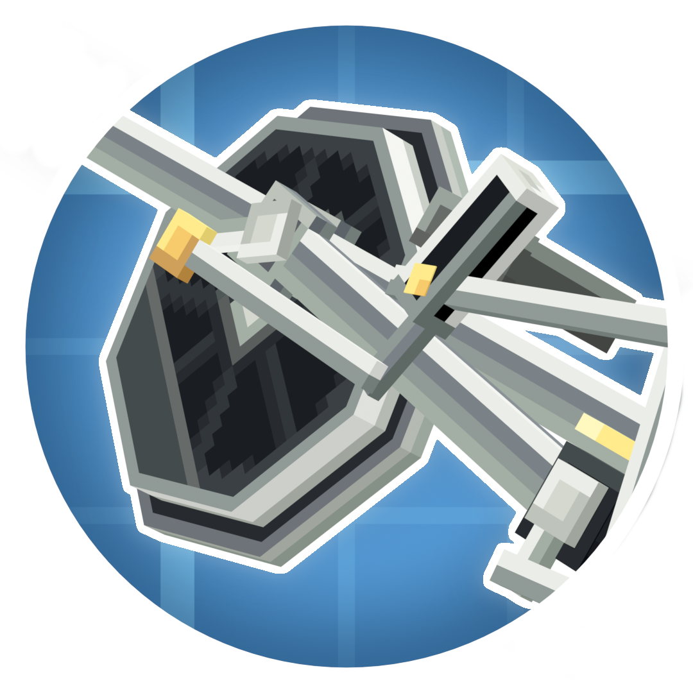

  
  <h1>Blocks & Bogies</h1>
	
	

___
## Blocks & Bogies is a Create addon that adds an abundance of different bogie styles to choose from, it also adds a selection UI so you can fine tune exactly what style you prefer.

## Driver Bogies:
    - Walschaerts Large
        - 0-4-0XL
        - 0-6-0EL
        - 0-6-0ES
        - 0-2-0L, 0-4-0L, 0-6-0L, 0-8-0L, 0-10-0L, 0-12-0L
        - 0-4-0S, 0-6-0S, 0-8-0S, 0-10-0S, 0-12-0S

    - Walschaerts Extra Large
        - 0-4-0XL
        - 0-6-0EL
        - 0-6-0ES
        - 0-2-0L, 0-4-0L, 0-6-0L, 0-8-0L, 0-10-0L
        - 0-4-0S, 0-6-0S, 0-8-0S, 0-10-0S

    - Gearless Large
        - 0-4-0XL
        - 0-6-0EL
        - 0-6-0ES
        - 0-2-0L, 0-4-0L, 0-6-0L, 0-8-0L, 0-10-0L, 0-12-0L
        - 0-4-0S, 0-6-0S, 0-8-0S, 0-10-0S, 0-12-0S

    - Gearless Extra Large
        - 0-4-0XL
        - 0-6-0EL
        - 0-6-0ES
        - 0-2-0L, 0-4-0L, 0-6-0L, 0-8-0L, 0-10-0L
        - 0-4-0S, 0-6-0S, 0-8-0S, 0-10-0S

    - Scotch Yoke Large
        - 0-2-0, 0-4-0, 0-6-0, 0-8-0, 0-10-0, 0-12-0

    - Scotch Yoke Extra Large
        - 0-2-0, 0-4-0, 0-6-0, 0-8-0, 0-10-0

    - Pistonless Large
        - 0-2-0, 0-4-0, 0-6-0, 0-8-0, 0-10-0, 0-12-0

    - Pistonless Extra Large
        - 0-6-0E
        - 0-2-0, 0-4-0, 0-6-0, 0-8-0, 0-10-0

## Truck Bogies:
    - Standard
        - 0-2-0E
        - 0-2-0, 0-4-0, 0-6-0, 0-8-0, 0-10-0

    - Trailing
        - 0-2-0, 0-4-0, 0-6-0, 0-8-0
    
___
## License

Blocks & Bogies is licensed under the MIT license, checkout [LICENSE](LICENSE) for more information.

Sections of code were used from the Create mod, which is licensed under the MIT license, check out [Create's license](https://github.com/Creators-of-Create/Create/blob/mc1.18/dev/LICENSE) for more information.

Sections of code were used from the Steam 'n Rails mod, which is licensed under the LGPL license, check out [Steam 'N Rails licence](https://github.com/Layers-of-Railways/Railway/blob/1.20/dev/LICENSE) for more information.
